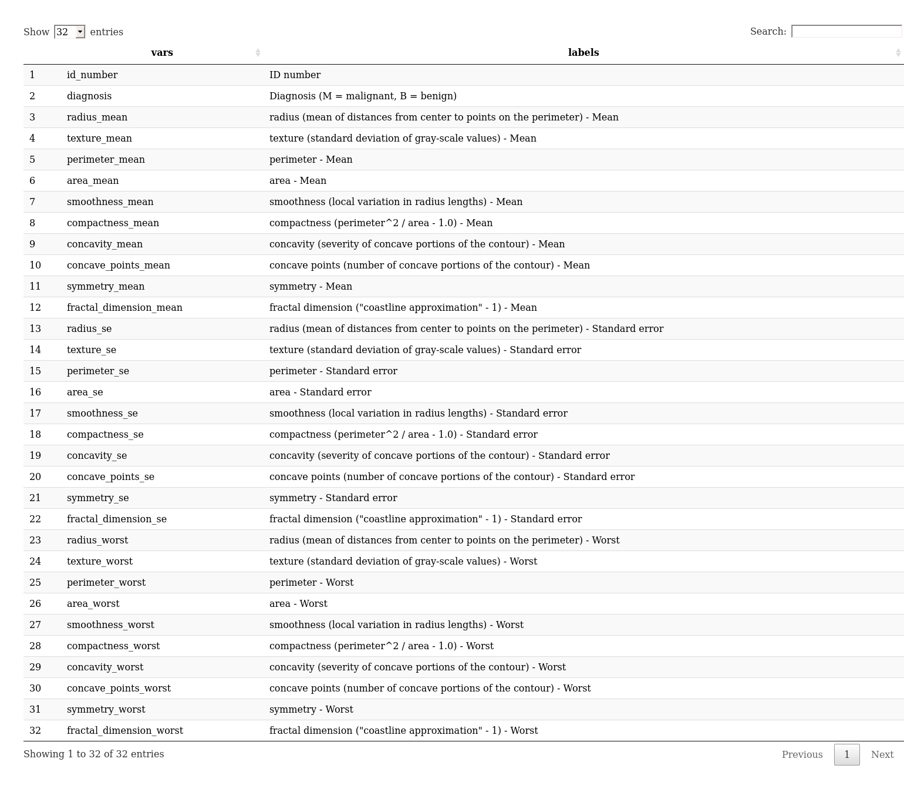
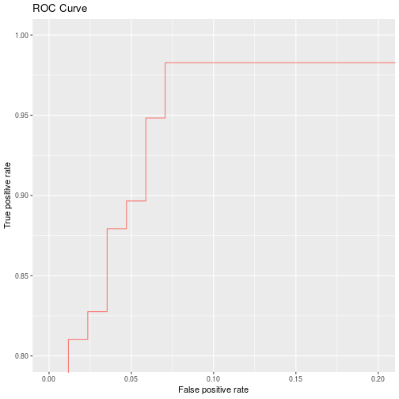

Neural Networks
========================================================
author: Steve
date: 2019-01-07
autosize: true


Data 
========================================================

* [Breast Cancer Wisconsin Data Set](https://archive.ics.uci.edu/ml/datasets/breast+cancer+wisconsin+(original)

> - The data set contains $569$ cases with $31$ variables. The diagnosis classification is either (M = Malignant) or (B = Benign).


===========================================================




Data Partition
===========================================================


```r
df2 <- (df
        %>% select(-id_number, -diagnosis)
        %>% transmute_if(is.numeric, scale)
        %>% add_column(diagnosis = df$diagnosis)
)

#Training proportion
prop <- 0.75 
n_train <- floor(0.75*nrow(df2))
index <- sample(1:nrow(df2), n_train)

# Train data
train_df <- df2[index, ]
x_train <- (train_df
    %>% select(-diagnosis)
  )
y_train <- ifelse(train_df$diagnosis=="M", 1, 0)


# Test data
test_df <- df2[-index, ]
x_test <- (test_df
    %>% select(-diagnosis)
  )
y_test <- ifelse(test_df$diagnosis=="M", 1, 0)
```


Feed-forward
=======================================================


```r
source("feedforward.R")
source("sigmoid.R")
feedforward
```

```
function (x, w1, w2) 
{
    x <- as.matrix.data.frame(x)
    H1 <- cbind(1, x) %*% w1
    a1 <- sigmoid(H1)
    H2 <- cbind(1, a1) %*% w2
    a2 <- sigmoid(H2)
    return(list(yhat = a2, H1 = H1, H2 = H2, a1 = a1))
}
```

Feed-forward fitting
========================================================


```r
hidden <- 5
n_ind_vars <- ncol(x_train) + 1
w1 <- matrix(
  rnorm(n_ind_vars * hidden)
    , n_ind_vars
    , hidden
  )
w2 <- as.matrix(rnorm(hidden + 1))

ff_out <- feedforward(x_train
    , w1
    , w2
  )

# Training error
yhat <- ifelse(ff_out$yhat>=0.5, 1, 0)
1 - mean(y_train==yhat)
```

```
[1] 0.2511737
```


Back propagation
=====================================================================


```r
source("backprop.R")
source("sigmoidPrime.R")
backprop
```

```
function (x, y, yhat, w1, w2, learn_rate, lambda, H1, H2, a1) 
{
    n <- dim(x)[1]
    delta <- -(y - yhat) * sigmoidPrime(H2)
    dJdW2 <- (t(cbind(1, a1)) %*% delta)/n + lambda * w2
    delta2 <- delta %*% t(w2[-1, drop = FALSE]) * sigmoidPrime(H1)
    dJdW1 <- (t(cbind(1, x)) %*% delta2)/n + lambda * w1
    w1 <- w1 - learn_rate * dJdW1
    w2 <- w2 - learn_rate * dJdW2
    return(list(w1 = w1, w2 = w2))
}
```

BP Fitting
=================================================================


```r
bp_out <- backprop(x_train
    , y_train
    , yhat = ff_out$yhat
    , w1
    , w2
    , lambda = 1e-2
    , learn_rate = 1e-2
    , H1 = ff_out$H1
    , H2 = ff_out$H2
    , a1 = ff_out$a1
  )

#bp_out$w1
bp_out$w2
```

```
           [,1]
[1,]  0.6835137
[2,] -0.6195262
[3,] -0.3569495
[4,]  0.3820663
[5,] -0.4591906
[6,] -1.7530753
```


Training the NN
==================================================================


```r
source("trainMynnet.R")
trainMynnet
```

```
function (x, y, hidden = 10, learn_rate = 0.01, lambda = 0.01, 
    iters = 10000) 
{
    x <- as.matrix.data.frame(x)
    hidden <- hidden
    n_xvars <- ncol(x) + 1
    w1 <- matrix(rnorm(n_xvars * hidden), n_xvars, hidden)
    w2 <- as.matrix(rnorm(hidden + 1))
    for (iter in 1:iters) {
        fprop <- feedforward(x, w1, w2)
        bprop <- backprop(x, y, yhat = fprop$yhat, w1, w2, lambda = lambda, 
            learn_rate = learn_rate, H1 = fprop$H1, H2 = fprop$H2, 
            a1 = fprop$a1)
        w1 <- bprop$w1
        w2 <- bprop$w2
    }
    return(list(yhat = fprop$yhat, w1 = w1, w2 = w2))
}
```

=================================================================


```r
nnet_out <- trainMynnet(x_train
    , y_train
  )

# Training error
yhat <- ifelse(nnet_out$yhat>=0.5, 1, 0)
round(1 - mean(y_train==yhat), digits = 5)
```

```
[1] 0.05634
```


Testing NN
=================================================================


```r
source("predictNnet.R")
predictNnet
```

```
function (object, newdata) 
{
    est <- feedforward(newdata, w1 = object$w1, w2 = object$w2)
    list(probs = est$yhat, class = ifelse(est$yhat >= 0.5, 1, 
        0))
}
```


=================================================================


```r
nnet_test <- predictNnet(nnet_out, x_test)

# Training error
round(1 - mean(nnet_test$class==y_test), digits = 5)
```

```
[1] 0.07692
```


================================================================



Bootstrap
=======================================================


```r
source("aucBoot.R")
aucBoot
```

```
function (data, reps) 
{
    resamples <- lapply(1:reps, function(i) data[sample(nrow(data), 
        replace = T), ])
    observed_auc <- aucFuc(data)
    r_auc <- sapply(resamples, aucFuc)
    std_error <- sd(r_auc)/sqrt(length(r_auc))
    quants <- as.vector(quantile(r_auc, c(0.025, 0.975)))
    est_df <- data.frame(`2.5%` = quants[[1]], Est = observed_auc, 
        `97.5%` = quants[[2]])
    result <- list(estimates = est_df, resample_auc = r_auc, 
        std_err = std_error, resamples = resamples)
    return(result)
}
```


====================================================

```r
df_pred <- data.frame(probs = nnet_test$probs
                      , response = y_test
                      )
boot_auc <- aucBoot(df_pred, 2000)
knitr::kable(boot_auc$estimates)
```


|     X2.5.|       Est|    X97.5.|
|---------:|---------:|---------:|
| 0.9640792| 0.9833671| 0.9971269|

